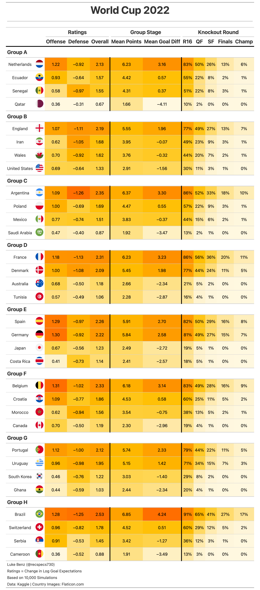

# FIFA World Cup 2022
---
Modeling and simulation of the 2022 FIFA World Cup

#### Model Script

* __fit_model.R:__ Estimates Bayesian bivariate Poisson model. For more details, see Equation (2) of [Benz and Lopez, 2021](https://link.springer.com/content/pdf/10.1007/s10182-021-00413-9.pdf).

#### Simulations

* __run_sim.R:__ Run 10,000 simulations of the tournament
* __helpers.R:__ Helper functions for sims.
* __game_preds.R__ Save out predictions for indivdual games.

#### Data
Data (__internation_soccer_score.csv__) courtesy [Kaggle](https://www.kaggle.com/martj42/international-football-results-from-1872-to-2017).

Flag figures courtesy of [Flaticon](https://www.flaticon.com/).

#### Pre-Tournament Predictions

#### Previous Tournaments
* [Euro Cup 2021](https://github.com/lbenz730/euro_cup_2021)
* [World Cup 2018](https://github.com/lbenz730/world_cup)
* [Women's World Cup 2019](https://github.com/lbenz730/womens_world_cup)
